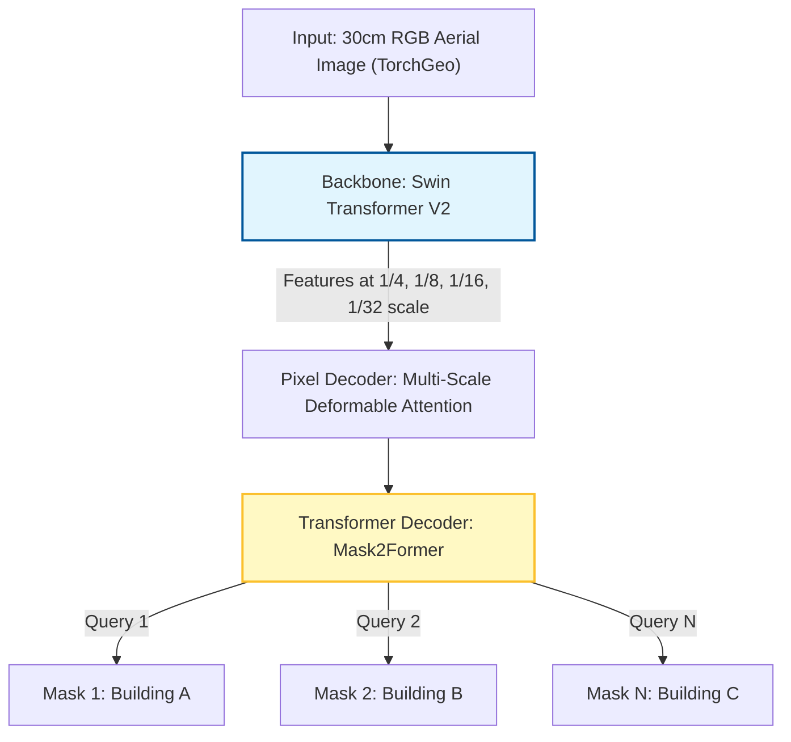

## Overview

This document outlines an experimental architecture exploration for high res images mainly for buildnig segmentation. I started with from the [RAMP](https://rampml.global/) (Replicable AI for Microplanning) 2020 Efficient-U-Net model. The original model represents excellent work by the RAMP team and has proven effective across diverse contexts. However, I've identified opportunities to enhance performance specifically in dense urban settlements by adopting recent advances in instance segmentation.

### Motivation

The current U-Net architecture encounters three specific technical challenges in dense informal settlements:

1. **The "Blob" Effect:** Touching buildings merge into single semantic blobs due to pixel-connectivity rather than instance-level reasoning.
2. **Overfitting on Limited Data:** Fine-tuning on small datasets (500–1000 chips) leads to poor generalization.
3. **Irregular Geometries:** Predictions lack sharp corners, producing shapes unsuitable for GIS vectorization.

This experiment proposes a composable architecture combining modern feature extraction with instance-based prediction.

---

## Architecture Design

### Component Selection

| Component | Selection | Justification |
|----------|-----------|---------------|
| Backbone | Swin Transformer V2 (Base) | Optimized for high-resolution windows (512×512). Captures texture and geometry better than CNNs. Pretrained on ImageNet-22K. |
| Head | Mask2Former | Uses 100 learnable queries to predict instance masks. Treats each building as a separate object, solving the blob problem. |
| Adapter | LoRA (Rank = 16) | Applied during Stage 2 fine-tuning. Enables geographic adaptation without catastrophic forgetting. |

---

## Training Strategy: Two-Stage Curriculum

We use curriculum learning to leverage large-scale RAMP data while preventing overfitting on target sites.

### Stage 1: Foundation Training (RAMP Supervised)

Goal: Teach semantic distinction between roof and ground in informal settlements.

- Data: 100,000 labeled RAMP image chips
- Method: Full fine-tuning (Backbone + Head)
- Initialization:
  - Backbone: ImageNet-22K pretrained weights
  - Head: Random initialization
- Hyperparameters: Fixed standard defaults
- Outcome: Robust base model understanding dense settlements

### Stage 2: Site-Specific Adaptation

Goal: Adapt to local soil colors, lighting, and building styles. , I am targeting around 1000 chips which is ideal for production level env

- Data: 1,000 project-specific chips (800 train / 200 validation)
- Method: Frozen backbone + LoRA adapters + trainable head
- Outcome: Site-specific model with strong generalization

---

## Loss Function

To address irregular building shapes, we extend standard Mask2Former loss with boundary constraints.

### Total Loss

$$
\mathcal{L}_{total} = \lambda_{ce}\,\mathcal{L}_{CE} + \lambda_{dice}\,\mathcal{L}_{Dice} + \lambda_{focal}\,\mathcal{L}_{Focal} + \alpha \cdot \mathcal{L}_{Boundary}
$$

### Components

- Cross-Entropy (L_CE): Binary classification (building vs background)
- Dice Loss (L_Dice): Optimizes spatial overlap
- Focal Loss (L_Focal): Emphasizes hard-to-classify pixels
- Hausdorff Boundary Loss (L_Boundary): Penalizes edge mismatch, enforcing sharp corners, I think this is important for our irregular geometry problem

---

## Implementation Details

### Hardware & Setup

- GPU: NVIDIA RTX 4090 (16 GB)
- Data Loading: TorchGeo streaming GeoTIFFs
- Bridge: Custom collate_fn converting TorchGeo tensors to Mask2Former format
- Memory Management: gradient_accumulation_steps = 8 (simulates batch size ~32)

### Estimated Timeline

| Activity | Duration | Notes |
|----------|----------|-------|
| Code Implementation | ~x hours | collate_fn and model definition |

---

## Hyperparameter Tuning (Stage 2 Only)

Stage 1 uses fixed hyperparameters. All tuning occurs during Stage 2 on the 200-chip validation set.

### Learning Rate

- Standard: 1e-4 (recommended starting point)
- Conservative: 1e-5 (if validation loss oscillates)
- Aggressive: 5e-4 (if convergence is too slow)

### Boundary Loss Weight (α)

- Low: 0.1 (recommended start)
- High: 0.5–1.0 (if edges remain irregular despite good separation)

### LoRA Rank

- Standard: 16 (best balance)
- Low: 8 (if overfitting occurs)
- High: 32 (if model fails to capture new roof textures)

---

## References

1. Liu et al. (2022). Swin Transformer V2: Scaling Up Capacity and Resolution. CVPR 2022.  
   [https://arxiv.org/abs/2111.09883](https://arxiv.org/abs/2111.09883)

2. Cheng et al. (2022). Masked-attention Mask Transformer for Universal Image Segmentation. CVPR 2022.  
   [https://arxiv.org/abs/2112.01527](https://arxiv.org/abs/2112.01527)

3. Kervadec et al. (2019). Boundary Loss for Highly Unbalanced Segmentation. MIDL 2019.  
   [https://arxiv.org/abs/1812.07032](https://arxiv.org/abs/1812.07032)
4. Download RAMP Data : [https://source.coop/ramp/ramp](https://source.coop/ramp/ramp)
5. RAMP Docs : [https://rampml.global/training-data/](https://rampml.global/training-data/) 
