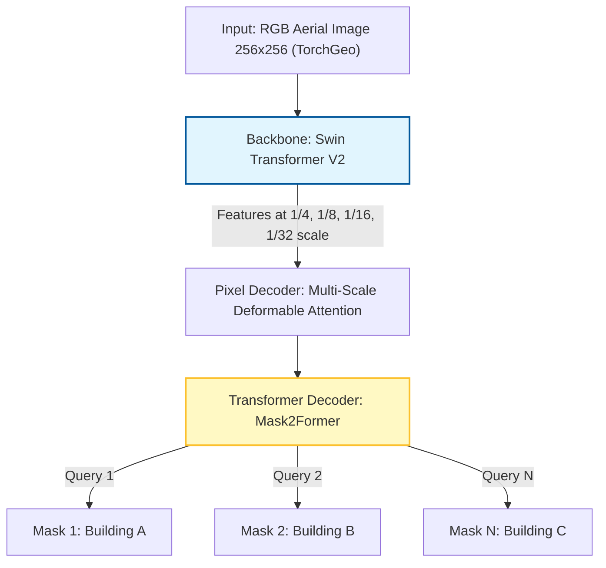

## Overview

This document outlines an experimental architecture exploration for high res images mainly for buildnig segmentation. I started with from the [RAMP](https://rampml.global/) (Replicable AI for Microplanning) 2020 Efficient-U-Net model. The original model represents excellent work by the RAMP team and has proven effective across diverse contexts. However, I've identified opportunities to enhance performance specifically in dense urban settlements by adopting recent advances in instance segmentation.

See Model Architecture Detail [here](docs/Model_architecture.md)

### Motivation

The current U-Net architecture encounters three specific technical challenges in dense informal settlements:

1. **The "Blob" Effect:** Touching buildings merge into single semantic blobs due to pixel-connectivity rather than instance-level reasoning.
2. **Overfitting on Limited Data:** Fine-tuning on small datasets (500–1000 chips) leads to poor generalization.
3. **Irregular Geometries:** Predictions lack sharp corners, producing shapes unsuitable for GIS vectorization.

This experiment proposes a composable architecture combining modern feature extraction with instance-based prediction.

## Architecture Design

### Component Selection

| Component | Selection | Justification |
|----------|-----------|---------------|
| Backbone | Swin Transformer V2 (Base) | Optimized for high-resolution windows (256×256). Captures texture and geometry better than CNNs. Pretrained on ImageNet-22K. |
| Head | Mask2Former | Uses 100 learnable queries to predict instance masks. Treats each building as a separate object, solving the blob problem. |
| Adapter | LoRA (Rank = 16) | Planned for Stage 2 fine-tuning. Enables geographic adaptation without catastrophic forgetting. |

Masked-attention Mask Transformer for Universal Image Segmentation :

## Training Strategy: Two-Stage Curriculum

We use curriculum learning to leverage large-scale RAMP data while preventing overfitting on target sites.

### Stage 1: Foundation Training (Current Implementation)

Goal: Teach semantic distinction between roof and ground in informal settlements.

- **Data**: Currently using Banepa dataset (train/val/test splits)
- **Method**: Full fine-tuning (Backbone + Head)
- **Initialization**:
  - Backbone: ImageNet-22K pretrained weights (Swin Transformer V2)
  - Head: COCO pretrained weights (facebook/mask2former-swin-base-IN21k-coco-instance)
  - 100 fixed learnable queries (from COCO pretraining)
- **Hyperparameters**: Fixed (learning_rate=1e-5, weight_decay=1e-4, batch_size=8, epochs=10)
- **Outcome**: Binary segmentation model with instance-aware predictions
- **Training**: 256x256 pixel chips with boundary-weighted Dice loss

### Stage 2: Site-Specific Adaptation (Planned)

Goal: Adapt to local soil colors, lighting, and building styles for production deployment.

- **Data**: 1,000 project-specific chips (800 train / 200 validation) - target for production
- **Method**: Frozen backbone + LoRA adapters + trainable head (not yet implemented)
- **Outcome**: Site-specific model with strong generalization

## Loss Function

To address irregular building shapes, we extend standard Mask2Former loss with boundary constraints.

### Total Loss

$$
\mathcal{L}_{total} = \mathcal{L}_{base} + \alpha \cdot \mathcal{L}_{BoundaryDice}
$$

Where $\mathcal{L}_{base}$ is the Mask2Former base loss (class loss + dice loss + mask loss) computed internally, and $\alpha$ is the boundary loss weight.

### Loss functions

- Cross-Entropy (L_CE): Binary classification (building vs background)
- Dice Loss (L_Dice): Optimizes spatial overlap
- Mask Loss: Combination of Dice loss and cross-entropy loss (Mask2Former replaced focal loss with cross-entropy. Source: <https://davidhuangal.bearblog.dev/mask2former/>)
- Boundary Dice Loss (L_Boundary): Boundary-weighted Dice loss that penalizes edge mismatch using 10x weight for boundary pixels, enforcing sharp corners for irregular geometries (implemented in training_step)

## Implementation Details

### Hardware & Setup

- GPU: ( Not sure yet )
- Data Loading: TorchGeo streaming GeoTIFFs with RandomGeoSampler (256 pixel size)
- Bridge: Custom collate_fn converting TorchGeo tensors to Mask2Former format
- Batch Size: 8 (default in config)

### Estimated Timeline

| Activity | Duration | Notes |
|----------|----------|-------|
| Code Implementation | ~x hours | collate_fn and model definition |

## Current Hyperparameters (Stage 1)

Currently implementing Stage 1 with fixed hyperparameters (Stage 2 with LoRA and Optuna tuning is planned).

### Optimizer Configuration

Using AdamW (Adam with decoupled weight decay): [https://arxiv.org/pdf/1711.05101](https://arxiv.org/pdf/1711.05101)

- **Learning Rate**: 1e-5 (0.00001) - conservative for fine-tuning pretrained model
- **Weight Decay**: 1e-4 (0.0001) - L2 regularization
- **Scheduler**: CosineAnnealingLR over 10 epochs

### Loss Weights

- **Class Weight**: 5.0
- **Dice Weight**: 5.0
- **Mask Weight**: 5.0
- **Boundary Loss Weight**: 2.0

### Future Tuning Plans (Stage 2)

Stage 2 will involve hyperparameter tuning using Optuna on validation set:

- LoRA adapter configuration (rank 8/16/32)
- Learning rate adjustment
- Boundary loss weight optimization

## References

1. Liu et al. (2022). Swin Transformer V2: Scaling Up Capacity and Resolution. CVPR 2022.  
   [https://arxiv.org/abs/2111.09883](https://arxiv.org/abs/2111.09883)

2. Cheng et al. (2022). Masked-attention Mask Transformer for Universal Image Segmentation. CVPR 2022.  
   [https://arxiv.org/abs/2112.01527](https://arxiv.org/abs/2112.01527)

3. Kervadec et al. (2019). Boundary Loss for Highly Unbalanced Segmentation. MIDL 2019.  
   [https://arxiv.org/abs/1812.07032](https://arxiv.org/abs/1812.07032)
4. Download RAMP Data : [https://source.coop/ramp/ramp](https://source.coop/ramp/ramp)
5. RAMP Docs : [https://rampml.global/training-data/](https://rampml.global/training-data/)
