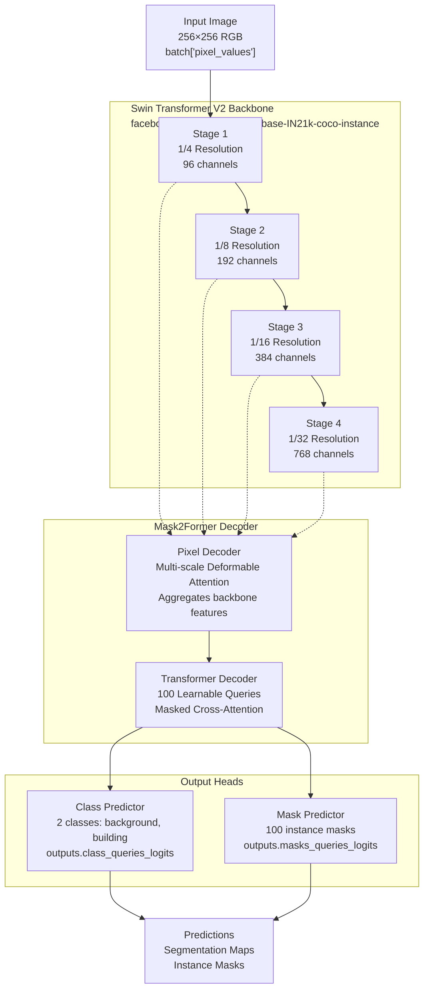
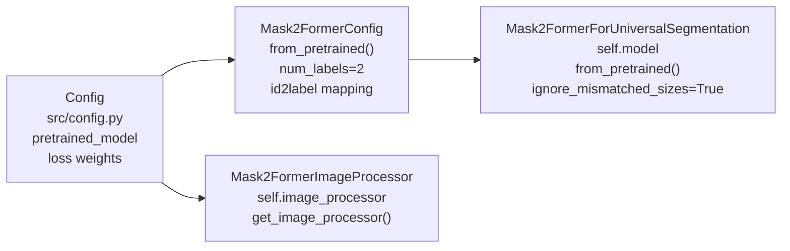
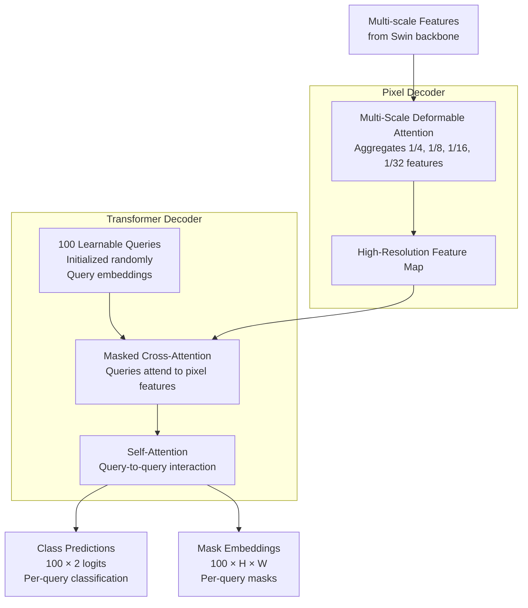
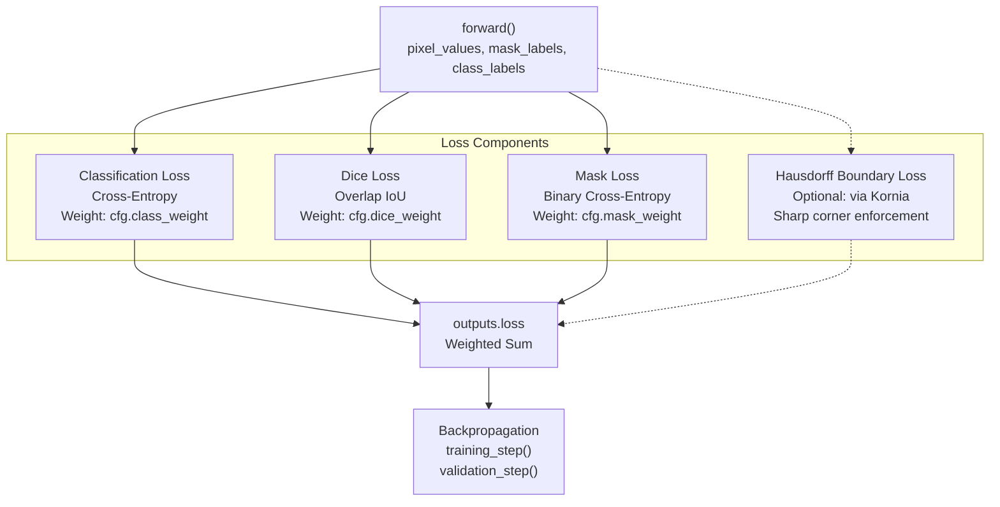
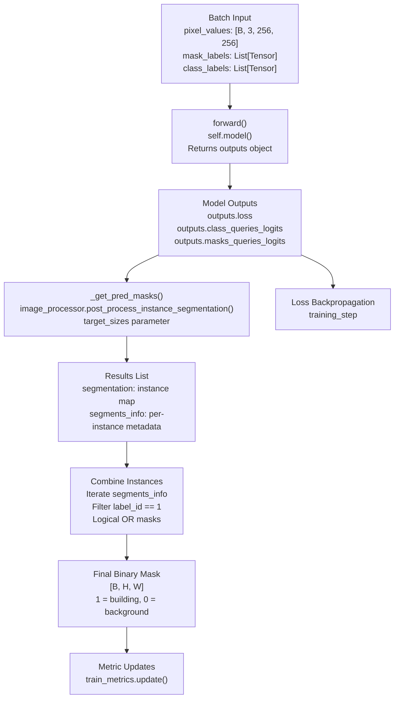

# Model Architecture

<details>
<summary>Relevant source files</summary>

The following files were used as context for generating this wiki page:

- [LICENSE](LICENSE)
- [README.md](README.md)
- [src/config.py](src/config.py)
- [src/stage1_foundation.py](src/stage1_foundation.py)

</details>


## Purpose and Scope

This document details the neural network architecture used for high-resolution building segmentation, including the Swin Transformer V2 backbone, Mask2Former head with 100 learnable queries for instance segmentation, and the multi-component loss function. For information about the two-stage training strategy that uses this architecture, see [Two-Stage Training Architecture](#1.1). For implementation details of the training pipeline, see [Training Pipeline](#3).

## Architecture Overview

The system combines a hierarchical vision transformer backbone with an instance segmentation head to predict individual building footprints from aerial imagery. The architecture is implemented in the `Mask2FormerModule` class and consists of three main components:

1. **Swin Transformer V2 Backbone**: Extracts multi-scale features using window-based self-attention
2. **Mask2Former Decoder**: Generates instance-level predictions via learnable queries
3. **Multi-Component Loss**: Optimizes for classification, overlap, and geometric precision



**Sources:** [src/stage1_foundation.py:27-65](), [README.md:15-26]()

## Model Initialization and Configuration

The `Mask2FormerModule` class wraps the pretrained `Mask2FormerForUniversalSegmentation` model from Hugging Face Transformers. Model configuration occurs in the `__init__` method:

| Configuration Parameter | Value | Purpose |
|------------------------|-------|---------|
| `pretrained_model` | `facebook/mask2former-swin-base-IN21k-coco-instance` | Base model with ImageNet-22K pretrained backbone |
| `num_labels` | 2 | Binary classification: background (0), building (1) |
| `ignore_index` | 255 | Label value to ignore in loss computation (empty masks) |
| `class_weight` | 5.0 (default) | Weight for classification loss component |
| `dice_weight` | 5.0 (default) | Weight for Dice loss component |
| `mask_weight` | 5.0 (default) | Weight for mask loss component |

The model is initialized from pretrained weights with `ignore_mismatched_sizes=True` to accommodate the change from COCO's 80 classes to binary classification.



**Sources:** [src/stage1_foundation.py:28-45](), [src/config.py:27-40]()

## Swin Transformer V2 Backbone

The backbone uses Swin Transformer V2 Base architecture, which processes images through hierarchical stages with shifted window-based self-attention. Key characteristics:

- **Pretrained Weights**: ImageNet-22K (21,841 classes), providing strong feature representations
- **Window Size**: Optimized for high-resolution inputs (256×256 or 512×512)
- **Multi-Scale Features**: Four stages produce features at different resolutions
- **Parameter Efficiency**: Attention computed within local windows, not globally

The backbone extracts features at four scales:
- **Stage 1** (1/4 resolution): Early spatial features with 96 channels
- **Stage 2** (1/8 resolution): Mid-level features with 192 channels  
- **Stage 3** (1/16 resolution): High-level features with 384 channels
- **Stage 4** (1/32 resolution): Deepest features with 768 channels

These multi-scale features enable the model to recognize buildings at different sizes, from small individual structures to large building complexes.

**Sources:** [README.md:32-36](), [src/stage1_foundation.py:34-45]()

## Mask2Former Decoder

The Mask2Former head consists of two sequential decoders that transform backbone features into instance predictions:

### Pixel Decoder

The pixel decoder aggregates multi-scale features from all backbone stages using multi-scale deformable attention. It produces high-resolution feature maps that capture both fine details and semantic context.

### Transformer Decoder

The transformer decoder uses **100 learnable queries** (object queries) to predict individual building instances. Each query:
- Learns to attend to specific regions in the feature maps
- Produces one class prediction (building vs. background)
- Generates one binary mask covering the building extent

This query-based approach solves the "blob effect" problem where touching buildings merge into single blobs, because each query represents a distinct instance rather than semantic regions.



**Sources:** [README.md:15-39](), [src/stage1_foundation.py:43-45]()

## Output Heads and Post-Processing

The transformer decoder feeds into two parallel prediction heads:

### Class Predictor

Produces logits for each of the 100 queries, predicting whether the query represents a building (class 1) or background (class 0). The model configuration defines the label mapping:

```python
id2label = {0: "background", 1: "building"}
label2id = {"background": 0, "building": 1}
```

### Mask Predictor  

Generates 100 binary masks, one per query, indicating the spatial extent of each predicted building. Masks are generated at a lower resolution and upsampled during post-processing.

### Post-Processing Pipeline

The `_get_pred_masks()` method in `Mask2FormerModule` converts model outputs into final predictions:

1. **Instance Segmentation**: `image_processor.post_process_instance_segmentation()` resolves overlapping masks and filters low-confidence predictions
2. **Segmentation Map Assembly**: Iterates through `segments_info` to build the final mask
3. **Binary Conversion**: Combines all building instances into a single binary segmentation map by logical OR operation

The post-processing only keeps predictions with `label_id == 1` (building class), ignoring background predictions.

**Sources:** [src/stage1_foundation.py:66-78](), [src/stage1_foundation.py:34-38]()

## Loss Function Components

The model optimizes a weighted combination of three loss components, with an optional fourth for geometric precision. Loss computation is handled internally by `Mask2FormerForUniversalSegmentation`:



### Classification Loss (Cross-Entropy)

Applied to class predictions for each of the 100 queries. Encourages the model to correctly classify queries as building or background. Weight controlled by `cfg.class_weight` (default: 5.0).

### Dice Loss

Measures the overlap between predicted and ground truth masks using the Dice coefficient (F1 score for segmentation). Optimizes spatial coverage and handles class imbalance better than pixel-wise losses. Weight controlled by `cfg.dice_weight` (default: 5.0).

### Mask Loss (Binary Cross-Entropy)

Applied at the pixel level within each predicted mask. Provides fine-grained supervision for mask boundaries. Weight controlled by `cfg.mask_weight` (default: 5.0).

### Hausdorff Boundary Loss (Optional)

Not currently implemented in the main training pipeline but planned for addressing irregular geometries. This loss would penalize edge mismatches using the Hausdorff distance, enforcing sharp corners and precise boundaries critical for GIS vectorization.

The total loss is computed as:

$$\mathcal{L}_{total} = \lambda_{class} \cdot \mathcal{L}_{CE} + \lambda_{dice} \cdot \mathcal{L}_{Dice} + \lambda_{mask} \cdot \mathcal{L}_{Mask} + \alpha \cdot \mathcal{L}_{Boundary}$$

Where λ parameters are configurable via the `Config` dataclass.

**Sources:** [src/stage1_foundation.py:39-41](), [src/config.py:35-37](), [README.md:67-82]()

## Metrics and Evaluation

The `Mask2FormerModule` tracks binary classification metrics during training, validation, and testing:

| Metric | Purpose | Implementation |
|--------|---------|----------------|
| Binary Accuracy | Overall pixel-level correctness | `BinaryAccuracy()` |
| Binary Precision | Proportion of predicted buildings that are correct | `BinaryPrecision()` |
| Binary Recall | Proportion of actual buildings detected | `BinaryRecall()` |
| Binary F1 Score | Harmonic mean of precision and recall | `BinaryF1Score()` |

Metrics are computed by flattening predicted and ground truth masks and comparing them pixel-wise. The model maintains separate `MetricCollection` instances for train, validation, and test phases with appropriate prefixes (`train_`, `val_`, `test_`).

During each step (`training_step`, `validation_step`, `test_step`), the model:
1. Performs forward pass to compute loss
2. Post-processes outputs to generate final predictions via `_get_pred_masks()`
3. Updates metrics by comparing predictions to ground truth
4. Logs metrics at epoch end

**Sources:** [src/stage1_foundation.py:47-128]()

## Forward Pass and Prediction Flow

The complete prediction pipeline implemented in `Mask2FormerModule`:



Key implementation details:

1. **Input Format**: Batches contain `pixel_values` tensor and lists of `mask_labels` and `class_labels` for each image
2. **Device Management**: Labels are moved to the model's device before forward pass
3. **Loss Computation**: Automatic via model's internal loss calculation
4. **Ground Truth Conversion**: Instance masks are converted to binary segmentation via `(m.sum(0) > 0).long()`
5. **Gradient Management**: Metrics updated within `torch.no_grad()` context during training to avoid memory overhead

**Sources:** [src/stage1_foundation.py:59-92](), [src/stage1_foundation.py:98-108]()

## Training and Optimization Configuration

The model uses the AdamW optimizer with cosine annealing learning rate schedule, configured in the `configure_optimizers()` method:

| Parameter | Default Value | Description |
|-----------|---------------|-------------|
| Optimizer | AdamW | Weight decay variant of Adam |
| Learning Rate | 1e-5 | Initial learning rate from `cfg.learning_rate` |
| Weight Decay | 1e-4 | L2 regularization penalty from `cfg.weight_decay` |
| Scheduler | CosineAnnealingLR | Gradually reduces LR to 0 over training |
| T_max | `cfg.epochs` | Number of epochs for full cosine cycle |

The cosine annealing schedule provides:
- Smooth learning rate decay from initial value to near-zero
- Better convergence properties than step decay
- No need for manual LR adjustment during training

The scheduler updates once per epoch (`interval="epoch"`, `frequency=1`) with strict enforcement of the schedule.

**Sources:** [src/stage1_foundation.py:130-147](), [src/config.py:38-40]()

## Visualization Capabilities

The `visualize_batch()` method provides side-by-side comparison of inputs, ground truth, and predictions for model debugging:

```python
model.visualize_batch(batch, num_samples=4, save_path="outputs/predictions.png")
```

The visualization creates a grid with three columns:
1. **Image**: Normalized input RGB image
2. **Ground Truth**: Binary mask from annotations  
3. **Prediction**: Model's predicted binary mask

This method:
- Sets model to evaluation mode (`self.eval()`)
- Performs inference without gradient computation
- Post-processes outputs via `_get_pred_masks()`
- Normalizes images to [0, 1] range for display
- Uses grayscale colormap for masks (0=black, 1=white)
- Optionally saves figure to disk

**Sources:** [src/stage1_foundation.py:149-192]()